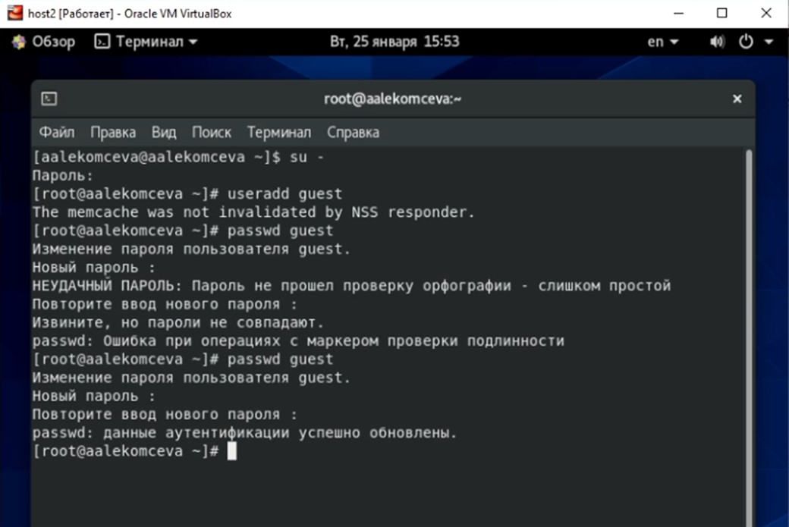
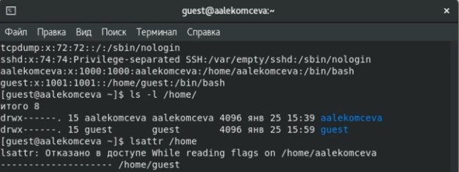
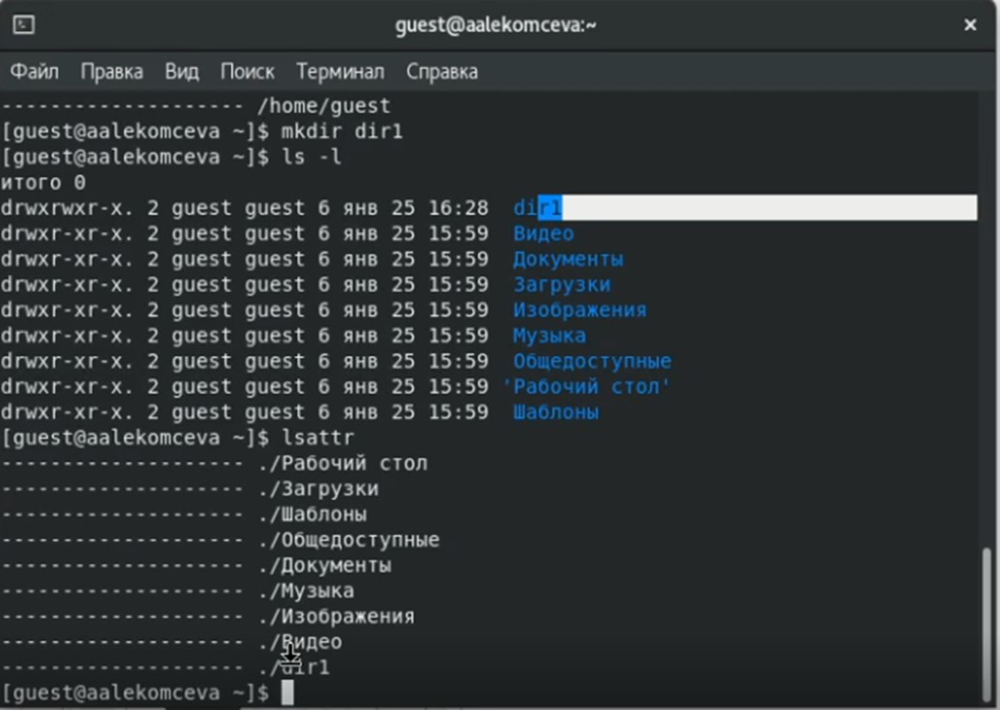
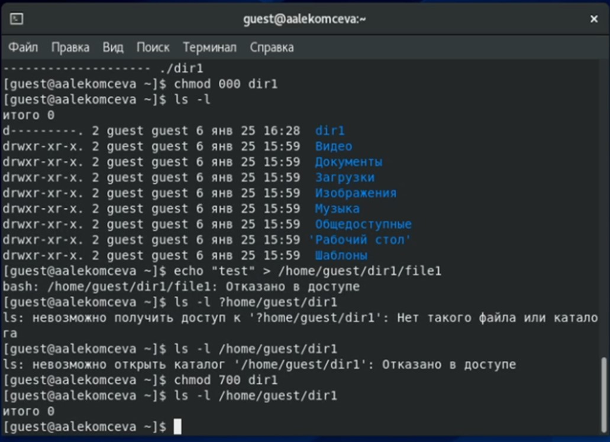
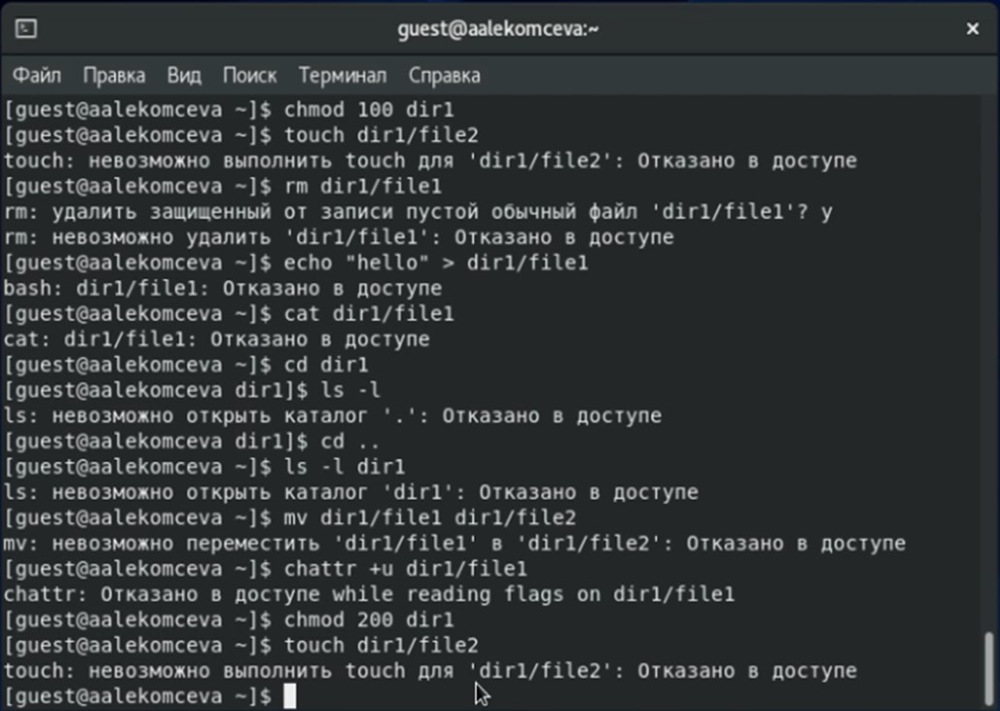

---
# Front matter
lang: ru-RU
title: 'Отчёт'
subtitle: 'по лабораторной работе 2'
author: 'Лекомцева Алёна'

# Formatting
toc-title: 'Содержание'
toc: true # Table of contents
toc_depth: 2
lof: true # List of figures
lot: true # List of tables
fontsize: 11pt
linestretch: 1.5
papersize: a4paper
documentclass: scrreprt
polyglossia-lang: russian
polyglossia-otherlangs: english
mainfont: PT Serif
romanfont: PT Serif
sansfont: PT Sans
monofont: PT Mono
mainfontoptions: Ligatures=TeX
romanfontoptions: Ligatures=TeX
sansfontoptions: Ligatures=TeX,Scale=MatchLowercase
monofontoptions: Scale=MatchLowercase
indent: true
pdf-engine: lualatex
header-includes:
  - \linepenalty=10 # the penalty added to the badness of each line within a paragraph (no associated penalty node) Increasing the value makes tex try to have fewer lines in the paragraph.
  - \interlinepenalty=0 # value of the penalty (node) added after each line of a paragraph.
  - \hyphenpenalty=50 # the penalty for line breaking at an automatically inserted hyphen
  - \exhyphenpenalty=50 # the penalty for line breaking at an explicit hyphen
  - \binoppenalty=700 # the penalty for breaking a line at a binary operator
  - \relpenalty=500 # the penalty for breaking a line at a relation
  - \clubpenalty=150 # extra penalty for breaking after first line of a paragraph
  - \widowpenalty=150 # extra penalty for breaking before last line of a paragraph
  - \displaywidowpenalty=50 # extra penalty for breaking before last line before a display math
  - \brokenpenalty=100 # extra penalty for page breaking after a hyphenated line
  - \predisplaypenalty=10000 # penalty for breaking before a display
  - \postdisplaypenalty=0 # penalty for breaking after a display
  - \floatingpenalty = 20000 # penalty for splitting an insertion (can only be split footnote in standard LaTeX)
  - \raggedbottom # or \flushbottom
  - \usepackage{float} # keep figures where there are in the text
  - \floatplacement{figure}{H} # keep figures where there are in the text
---

# Цель работы

Получение практических навыков работы в консоли с атрибутами файлов, закрепление теоретических основ дискреционного разграничения доступа в современных системах с открытым кодом на базе ОС Linux1.

# Задание

Лабораторная работа подразумевает дискреционное разграничение прав в Linux. Освоение основных атрибутов

# Выполнение лабораторной работы

1. Создаю учётную запись пользователя guest и задаю пароль: (рис.1).

   { #fig:001 width=60% }

2. Вхожу в систему от имени нового пользователя. 
   Определяю директорию, в которой нахожусь, командой _pwd_. 
   С помощью команды _whoami_ уточняю имя пользователя. 
   Уточняю имя нашего пользователя, его группу, а также группы, куда входит пользователь, командой _id_. Ввожу команду _groups_, которая выводит группу, в которой состоит пользователь (группа guest).  Обе команды выдают одинаковое значение касательно этого пункта.
   Вывожу в терминал файл /etc/passwd командой _cat /etc/passwd_. Нахожу в нём свою учётную запись (guest:x:1001:1001: :/home/guest:/bin/bash). Определяю uid = 1001, gid = 1001. Сравниваю найденные значения с полученными от команд _id_ и _groups_. Значения совпадают. Мы видим, что Guest – это User-Name, x - Encrypted password entry, 1001 - User Id (UID), 1001 - Group Id (GID). (рис.2).

   { #fig:002 width=60% }
   
3. Определяю существующие в системе директории командой _ls -l_, которая выводить список доступных     файлов и каталогов в директории /home. guest и aalekomceva - это директории, о чем свидетельствует флаг d, тогда: 
для директории guest - полные права (rwx). 
для директории aalekomceva - полные права (rwx).
Проверяю, какие расширенные атрибуты установлены на поддиректориях, находящихся в директории /home, командой _lsattr_. Для guest нет расширенных атрибутов. Расширенные атрибуты других пользователей увидеть не удалось, так как недостаточно прав. (рис.3).

   { #fig:003 width=60% }

4. Создаю в домашней директории поддиректорию dirl командой _mkdir_. Определяю командами _ls -l_ и _lsattr_, какие права доступа и расширенные атрибуты были выставлены на директорию dirl. (рис.4) 

   { #fig:004 width=60% }

5. Снимаю с директории dir1 все атрибуты командой _chmod 000 dir1_ и проверяю с помощью команды _ls -l_ правильность выполнения. Пытаюсь создать в директории dirl файл file1 командой _echo "test" > /home/guest/dir1/file1_. Файл создать не удалось так как недостаточно прав для создания файла. Проверила это, вернув директории все права командой _chmod 700 dir1_ и просмотрев директорию еще раз. Действительно, файл не создался. (рис.5).

   { #fig:005 width=60% }

6. Последовательно проверяю, какие действия возможны в зависимости от выставленных прав на директорию и файл. Заполняю таблицу «Установленные права и разрешённые действия». (рис.6)

   { #fig:006 width=60% }

7. Получаю такую таблицу (табл.1):

   { #fig:007 width=60% }

8. На основании заполненной таблицы определим те или иные минимально необходимые права для выполнения операций внутри директории dir1. (табл.2)

   { #fig:008 width=60% }

# Выводы

В результате выполнения данной лабораторной работы я получила практические навыки работы в консоли с атрибутами файлов, закрепила теоретические основы дискреционного разграничения доступа в современных системах с открытым кодом на базе ОС Linux. 
